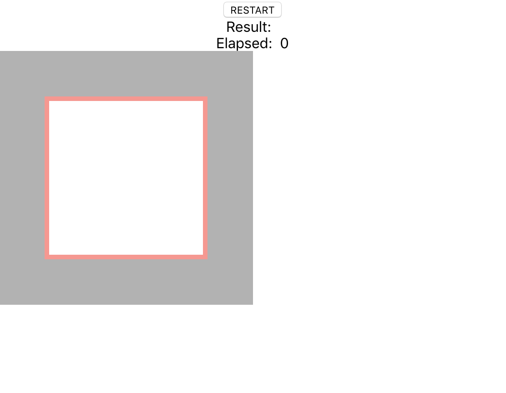

# README

## What is 

* SPA site for performance checking of `React QR Reader` 

## Access URL

* https://eigo-mt-fuji.github.io/js-qrcode-elapse/

## How to use

1. Prepare `iPhone` or `Android` and Open `https://eigo-mt-fuji.github.io/js-qrcode-elapse/` page
   - `Chrome` or `Safari`
2. Click `RESTART` button. Scan your QR code.
3. Scan `Result` and `Elapse` are shown

